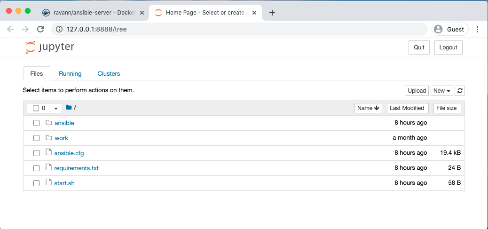
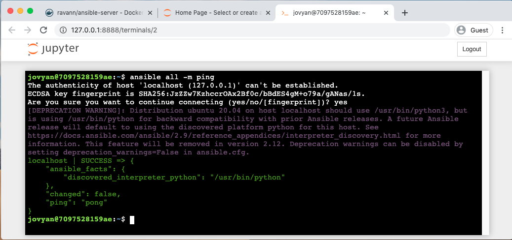

**Purpose**

Create a playground for ansible.

The image is built on top of Jupyter/base-notebook, so its easy to build python code and also initiate terminal from the web interface

**Running docker**

```bash
docker run -d -p 8888:8888 --name ansible-test ravann/ansible-server:latest
```

**Launching Jupyter Web**

```bash
docker logs -f ansible-test
```

You will see the below lines in the logs:

```log
        http://<DOCKER HOSTNAME>:8888/?token=<TOKEN>
     or http://127.0.0.1:8888/?token=<TOKEN>
```

Copy-paste the url "127.0.0.1" into the browser to launch the Jupyter. You can launch the terminal using the new button.



**Trying ansible**


